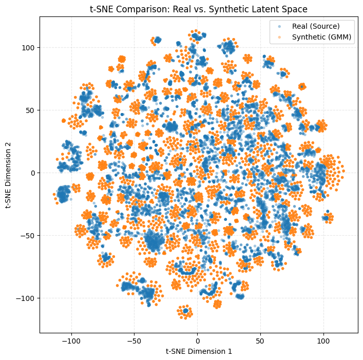

# freesound-solr-evaluation
toolbox for evaluating freesound's vector similarity and search performance

## Structure
- `search/`: scripts for initiating/managing Solr, indexing data, and training pca models
- `eval/`: scripts for evaluating search performance. also contains evaluation results.
- `models/`: saved PCA models
- `schema/`: schema definitions for Solr


## Basic setup
1. Create a Python virtual environment and install dependencies
```
python -m venv venv
source venv/bin/activate
pip install -r requirements.txt
```
2. Specify the data directory
Set the `SEARCH_DOCUMENTS_DIR` environment variable to point to the directory containing the JSONs exported from Freesound.
```bash
export SEARCH_DOCUMENTS_DIR="[wherever the JSONs are stored]"
```

3. Start Docker engine and Solr
```
docker-compose up -d
```
3. Initialize Solr with Freesound schema
```
python search/setup.py
```

## Loading Data (Indexing)
The `index_to_solr.py` script indexes sound metadata and vectors from your configured `SEARCH_DOCUMENTS_DIR`.

**Check indexing status:**
```bash
python search/index_to_solr.py --status
```

**Index all files:**
```bash
python search/index_to_solr.py --index-all
```

**Index a specific number of new files (e.g. 50):**
```bash
python search/index_to_solr.py --index-new 50
```

*Note: Add `--clear` to wipe the collection before indexing (e.g. `python search/index_to_solr.py --clear --index-all`).*

## Dimensionality Reduction (PCA)
Use `search/pca.py` to train PCA models and re-index vectors with reduced dimensionality.

**Fit model and re-index (Standard Workflow):**
```bash
# Fits PCA model and re-indexes vectors to 128 dimensions
python search/pca.py --fit --reindex --dims 128
```

**Fit model only:**
```bash
python search/pca.py --fit --dims 128
```

**Resume from checkpoint:**
```bash
# Resume if re-indexing was interrupted
python search/pca.py --reindex --dims 128 --checkpoint models/pca_checkpoint_laion_clap_pca128.json
```

## Synthetic Data Generation
To test Solr performance at scales larger than the available dataset, `search/generate_and_index_synthetics.py` generates realistic "fake" embedding vectors using a Gaussian Mixture Model (GMM).

**Fit model and generate data:**
```bash
# Fits GMM on existing data and generates 1 million synthetic vectors
python search/generate_and_index_synthetics.py --fit --find-k --generate 1000000
```
You can use `--seed` to specify a random state or `--k` to specify the number of components for the GMM. By default, it will use `find-k` to automatically optimize K using the elbow method and Bayesian Information Criterion (BIC), but by default it tests `k=100` to `k=1000` in steps of 100. With 100k vectors, I found that `k=800` works fairly well.

**Generate more data (using existing model):**
```bash
python search/generate_and_index_synthetics.py --generate 500000
```

<p align="center">
  
</p>

**Cleanup synthetic data:**
```bash
python search/generate_and_index_synthetics.py --cleanup
```

## Evaluating Search Performance
The `eval/` directory contains scripts for measuring search performance (recall and latency).

**Batch Evaluation (Recommended):**
Evaluates multiple dimensions against a baseline with warmup and cache handling.
```bash
python eval/run_batch_eval.py \
    --seed 100 \
    --num-sounds 4000 \
    --source-space laion_clap \
    --dims 64 128 256 \
    --warmup 500 \
    --save-details
```

**Single Space Evaluation:**
Evaluates a specific similarity space individually.
```bash
# Run eval and save ground truth for future comparisons
python eval/evaluate_similarity_search.py --space laion_clap --num-sounds 2000 --seed 100 --save-ground-truth
```

### Results
Output is saved to `eval/results/{run_name}/`:
- `results.csv`: Summary metrics (recall, latency, qps).
- `ground_truth.pkl`: The similarity results returned by original similarity vectors (512-dim).
- `per_query_results.pkl`: Dataframes containing query-by-query results (useful for analyzing latency distribution).